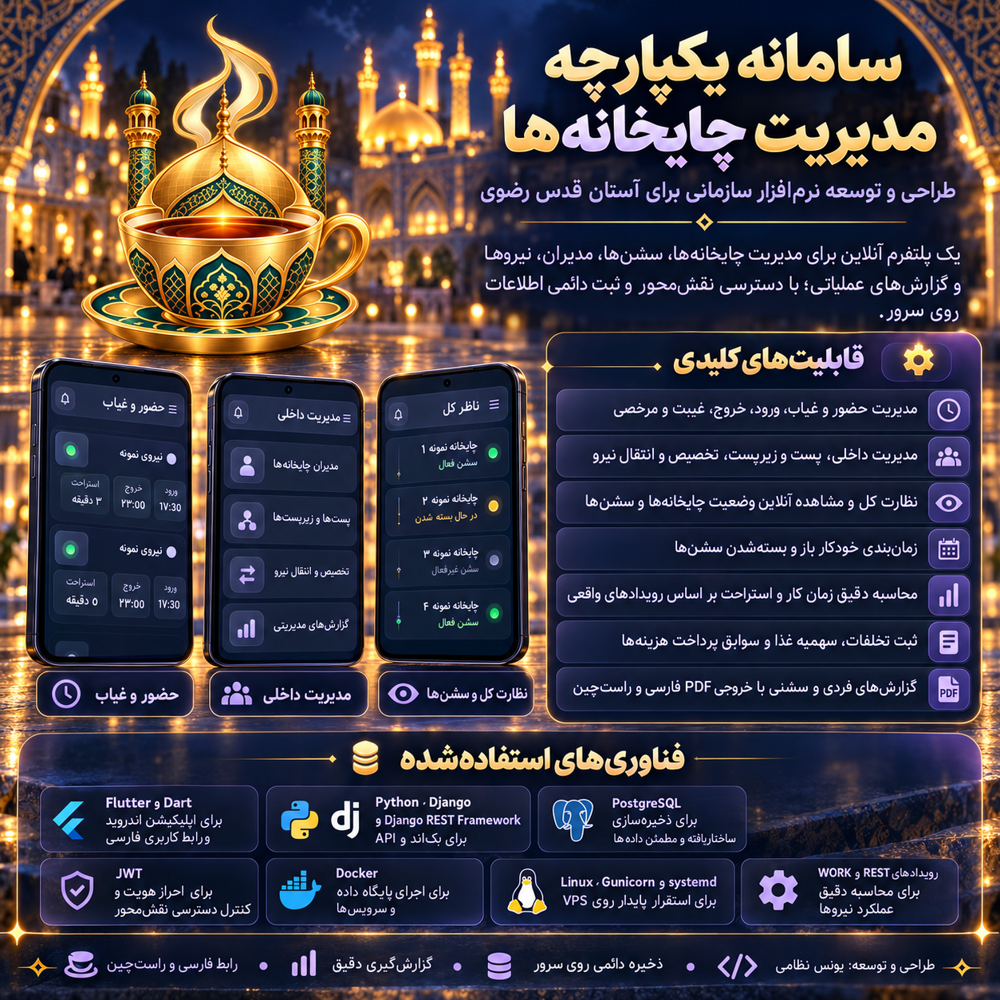
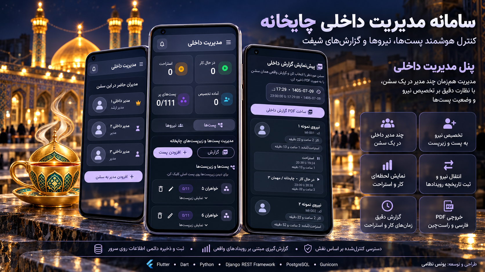
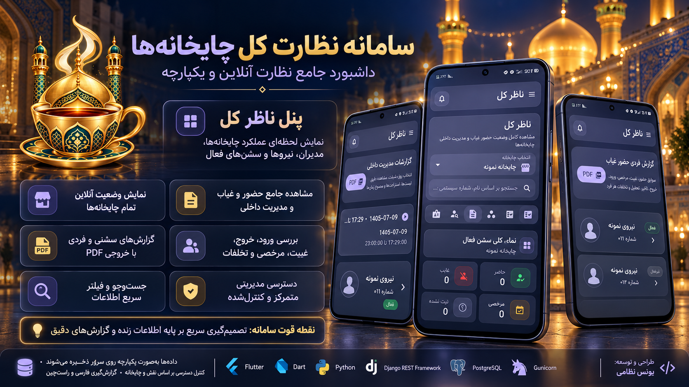
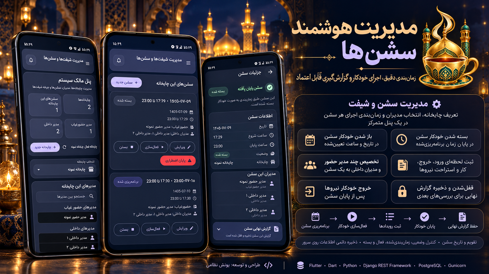

# TeaApp

سامانه یکپارچه مدیریت چایخانه‌ها، طراحی‌شده برای آستان قدس رضوی.

## فناوری‌ها

- Flutter و Dart
- Python و Django
- Django REST Framework
- PostgreSQL
- JWT
- Docker
- Linux
- Gunicorn و systemd

## قابلیت‌ها

- مدیریت حضور و غیاب
- مدیریت داخلی و تخصیص پست
- مدیریت سشن‌ها و زمان‌بندی خودکار
- پنل ناظر کل
- گزارش‌گیری PDF فارسی و راست‌چین
- ثبت رویدادهای کار و استراحت
- کنترل دسترسی نقش‌محور

## تصاویر پروژه

