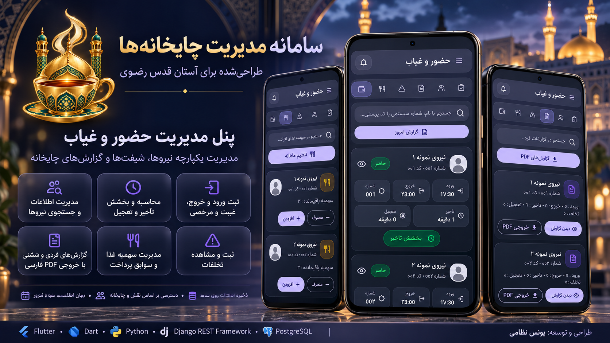

# سامانه یکپارچه مدیریت چایخانه‌ها

سامانه‌ای حرفه‌ای برای مدیریت، کنترل و نظارت بر عملکرد چایخانه‌ها که برای **استان قدس رضوی** طراحی و توسعه داده شده است.

این پروژه با هدف دیجیتالی‌کردن فرآیندهای حضور و غیاب، مدیریت نیروها، کنترل پست‌ها، ثبت فعالیت مدیران، زمان‌بندی سشن‌ها و تولید گزارش‌های دقیق طراحی شده است. سامانه امکان فعالیت هم‌زمان چند مدیر در یک سشن را فراهم می‌کند و تمام رویدادهای کاری و استراحت نیروها را به‌صورت دقیق در سرور ذخیره می‌کند.

## فناوری‌های استفاده‌شده

- Flutter
- Dart
- Riverpod
- Dio
- GoRouter
- Python
- Django
- Django REST Framework
- PostgreSQL
- JWT Authentication
- Docker
- Linux
- Gunicorn
- systemd
- RESTful API
- PDF Generation
- Persian RTL UI

## معماری پروژه

پروژه از معماری کلاینت و سرور تشکیل شده است:

- اپلیکیشن موبایل با Flutter و Dart
- API مرکزی با Django REST Framework
- پایگاه‌داده PostgreSQL
- احراز هویت با JWT
- اجرای سرویس روی Linux VPS
- مدیریت سرویس با systemd
- اجرای بک‌اند با Gunicorn
- استفاده از Docker برای اجرای پایگاه‌داده

تمام اطلاعات اصلی شامل کاربران، نیروها، پست‌ها، سشن‌ها، حضور و غیاب، رویدادهای کاری، استراحت، تخلفات، سهمیه‌ها و پرداخت‌ها در سمت سرور ذخیره می‌شوند.

## پنل‌های سامانه

### پنل مدیریت حضور و غیاب

این پنل برای کنترل ورود و خروج نیروها طراحی شده است و امکانات زیر را ارائه می‌دهد:

- ثبت ورود نیرو
- ثبت خروج نیرو
- ثبت وضعیت حضور، غیبت و مرخصی
- ثبت تأخیر و تعجیل
- بخشش تأخیر و تعجیل
- مدیریت نیروهای هر چایخانه
- جست‌وجوی سریع نیروها
- ثبت تخلفات
- مدیریت سهمیه غذا
- گزارش‌گیری دقیق حضور و غیاب
- خروجی PDF فارسی و راست‌چین
- نمایش آخرین وضعیت نیروها بر اساس سشن مربوطه

### پنل مدیریت داخلی

این پنل برای مدیریت فعالیت نیروها در پست‌ها و کنترل وضعیت لحظه‌ای آن‌ها طراحی شده است:

- نمایش کارت نیروها
- ثبت وضعیت آماده‌باش و استراحت
- تخصیص نیرو به پست
- ثبت شروع و پایان کار
- ثبت شروع و پایان استراحت
- انتقال نیرو بین مدیران داخلی
- پشتیبانی از چند مدیر داخلی در یک سشن
- نمایش تایمر دقیق کار و استراحت
- مدیریت پست‌های اصلی و زیرپست‌ها
- ویرایش و حذف نرم پست‌ها
- حفظ اطلاعات پست‌های قدیمی در گزارش‌های تاریخی
- ثبت رویدادهای واقعی در سرور
- گزارش‌گیری کارکرد نیروها
- خروجی PDF فارسی و راست‌چین

### پنل ناظر کل

پنل ناظر کل برای نظارت جامع بر عملکرد چایخانه‌ها طراحی شده است:

- مشاهده اطلاعات چایخانه‌ها
- مشاهده وضعیت آنلاین نیروها
- مشاهده سشن‌های فعال و بسته‌شده
- بررسی گزارش‌های حضور و غیاب
- بررسی گزارش‌های مدیریت داخلی
- گزارش فردی نیروها
- گزارش عملکرد مدیران
- مشاهده تخلفات
- مشاهده رویدادهای کاری و استراحت
- گزارش‌گیری PDF
- امکان بررسی عملکرد چند چایخانه از یک پنل مرکزی
- کنترل دسترسی بر اساس نقش و شعبه

## مدیریت سشن‌ها

سشن‌ها دارای تاریخ، ساعت شروع و ساعت پایان هستند و وضعیت آن‌ها به‌صورت خودکار مدیریت می‌شود:

- سشن‌های آینده در وضعیت زمان‌بندی‌شده قرار می‌گیرند.
- در زمان شروع، سشن به‌صورت خودکار فعال می‌شود.
- پس از رسیدن به زمان پایان، سشن به‌صورت خودکار بسته می‌شود.
- با بسته‌شدن سشن، ورود و خروج نیروها تکمیل می‌شود.
- استراحت‌ها و فعالیت‌های باز بسته می‌شوند.
- گزارش‌های نهایی در سرور ذخیره می‌شوند.
- تمام رویدادهای ثبت‌شده حتی پس از بسته‌شدن سشن قابل گزارش‌گیری هستند.

## ثبت رویدادهای دقیق

سیستم برای محاسبه دقیق کارکرد نیروها از رویدادهای واقعی استفاده می‌کند:

- `WORK_START`
- `WORK_END`
- `REST_START`
- `REST_END`
- `SHIFT_EXIT`

مدت زمان کار و استراحت از اختلاف زمانی رویدادهای ثبت‌شده در سرور محاسبه می‌شود؛ بنابراین خروج و ورود دوباره به برنامه باعث صفرشدن تایمرها نمی‌شود.

## امنیت و سطح دسترسی

سامانه دارای سطح دسترسی نقش‌محور است و هر کاربر بر اساس نقش خود به بخش‌های مشخصی دسترسی دارد:

- مدیر حضور و غیاب
- مدیر داخلی
- مالک سامانه
- ناظر کل
- مدیر شعبه

احراز هویت با JWT انجام می‌شود و دسترسی به APIها بر اساس نقش کاربر، چایخانه و سطح مجوز کنترل می‌گردد.

## گزارش‌گیری

گزارش‌های سامانه به‌صورت فارسی، راست‌چین و مناسب چاپ تولید می‌شوند:

- گزارش حضور و غیاب سشن
- گزارش مدیریت داخلی سشن
- گزارش فردی نیرو
- گزارش عملکرد مدیران
- گزارش تخلفات
- گزارش پرداخت‌ها
- گزارش کارکرد و استراحت
- خروجی PDF کارت‌بندی‌شده برای هر نیرو
- نمایش نام سشن، مشخصات نیرو، رویدادها و مجموع زمان‌ها

## ویژگی‌های فنی مهم

- ارتباط امن و ساختاریافته بین اپلیکیشن و سرور
- ذخیره دائمی اطلاعات در PostgreSQL
- APIهای RESTful
- مدیریت خطا و تمدید توکن
- پشتیبانی از اجرای هم‌زمان چند کاربر
- زمان‌بندی خودکار سشن‌ها
- ثبت رویدادهای قابل پیگیری
- طراحی فارسی و راست‌چین
- تولید PDF با فونت فارسی
- قابلیت توسعه برای چندین چایخانه
- قابلیت مدیریت چند مدیر در یک سشن
- حفظ گزارش‌های تاریخی حتی پس از حذف نرم پست‌ها

## تصاویر پروژه

##

## توسعه‌دهنده

**یونس نظامی**

دانشجوی کارشناسی مهندسی کامپیوتر  
دانشگاه سجاد مشهد

این سامانه با تمرکز بر طراحی محصول، توسعه اپلیکیشن Flutter، طراحی API، مدیریت پایگاه‌داده، کنترل دسترسی، گزارش‌گیری و استقرار سرویس سمت سرور توسعه داده شده است.
